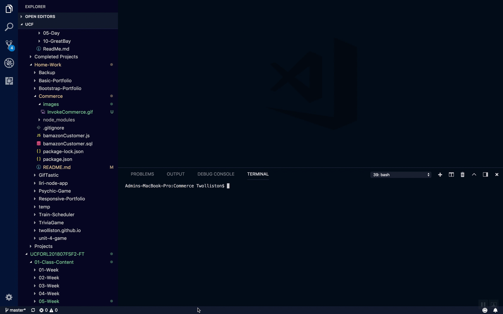

# Commerce

---
## Overview
---
### Here we have an Amazon-like storefront with the MySQL. The app will take in orders from customers and deplete stock from the store's inventory. Allow end user to exit application as well as making sure 

## Snapshot
---
Invoke application

Place order & quit

## Technologies used
* nodeJS
* javascript
* NPM
    * mysql
    * inquirer
    * console.table
    * chalk
* mySQL
* MAMP

